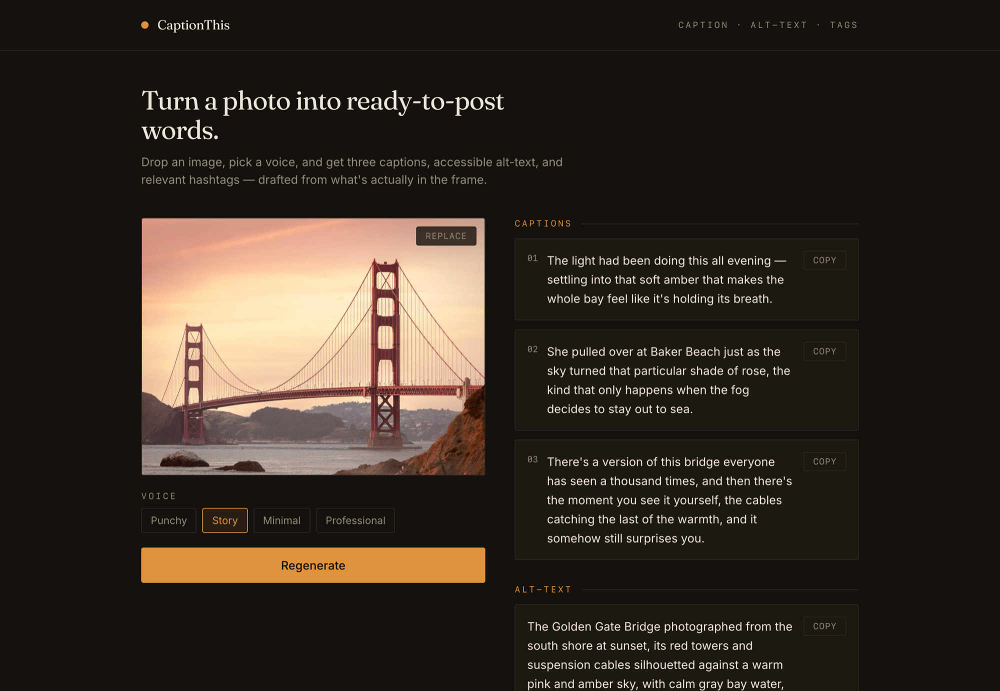

# CaptionThis

**Drop in a photo → get three captions, accessible alt-text, and relevant hashtags** —
drafted by Claude from what's actually in the frame. Pick a voice (Punchy, Story, Minimal,
Professional) and regenerate until it fits.

**Live demo → [captionthis.gpagani20251.workers.dev](https://captionthis.gpagani20251.workers.dev)**



---

## Why it's built this way

The browser **never** sees the Anthropic API key. The React app downscales the image, then
sends it to a Supabase Edge Function that holds the key as a server secret and calls Claude.
That one architectural choice — a server-side key proxy instead of calling Anthropic from the
browser — is the difference between a tutorial demo and something you can leave running on the
public internet.

A key in the browser is readable by anyone who opens devtools. A key behind an unauthenticated
function is only slightly better: scrapers hit `/functions/v1/*` paths automatically and can loop
it until the bill runs up. So the proxy is also **origin-locked, rate-limited, and payload-capped**,
with an Anthropic console spend limit as the hard backstop.

```
[ Cloudflare Workers ]                   [ Supabase Edge Function (Deno) ]           [ Anthropic ]
  React app (static)                     origin allowlist · per-IP rate limit  ──▶  Claude vision
  downscale to 1568px ──base64 JPEG──▶   payload/type caps · forced-JSON + validate   (Sonnet 4.6)
  (never sees the key)                                  │                                   │
         ▲                                              │                                   │
         └──────────── validated { captions, altText, hashtags } ◀─────────────────────────┘

  ANTHROPIC_API_KEY lives only as a Supabase secret — it is never in the shipped bundle.
```

At ~3K input tokens per image, a generation costs about **1.5¢** — the rate limit and spend
limit exist so that number can never surprise anyone.

---

## What makes it production-grade, not a wrapper

- **Survives real photos.** A 12MP phone JPEG base64-encodes past Anthropic's image ceiling and
  would fail. The client downscales to a 1568px long edge (JPEG q0.85) before upload — also baking
  in EXIF orientation, flattening transparency, and stripping metadata (including GPS).
- **Model output is treated as untrusted.** Claude is *forced* to answer via a tool call, so the
  reply is structured JSON — no brittle string-scraping. A validator then enforces the contract the
  schema can't (exactly 3 non-empty captions, non-empty alt-text, 8–12 unique `#`-hashtags), with
  one silent retry before a real error. The UI never renders an unvalidated shape.
- **Four genuinely distinct voices.** Each tone carries exemplar captions and an explicit *avoid*
  clause, so "Punchy" and "Minimal" don't collapse into each other.
- **Regenerate + per-tone cache.** Switching to a tone you've already generated is instant and
  free; regenerating forces a fresh call.
- **Locked-down endpoint.** Origin allowlist (blocks cross-origin scripts and curl, not just
  browsers), per-IP rate limit (10/hr via an atomic Postgres counter), and server-side re-checks of
  media type and payload size — the client's downscaling is never trusted.
- **No leaks.** Error responses are generic; upstream detail is logged server-side only.
- **Accessible.** WCAG AA contrast throughout, full keyboard path (real `<label>`-backed file
  input, visible focus rings on every stop), and an `aria-live` results region.

---

## Stack

React + Vite + Tailwind, served as static assets from **Cloudflare Workers** (Git-connected —
push to `main` deploys). Backend is a single **Supabase Edge Function** (Deno) fronting
**Claude Sonnet 4.6** vision, with the per-IP rate limit in Postgres. CI builds every push.

---

## Run your own

### 1. Frontend

```bash
npm install
cp .env.example .env.local   # fill in the two values (step 4)
npm run dev
```

### 2. Supabase project

Create a project at [supabase.com](https://supabase.com). Note your **Project URL** and
**anon public key** (Project Settings → API).

### 3. Function, secrets, rate-limit table

```bash
supabase login
supabase link --project-ref YOUR-PROJECT-REF

# Secrets (server-side; never in the bundle)
supabase secrets set ANTHROPIC_API_KEY=sk-ant-your-key-here
supabase secrets set ALLOWED_ORIGINS="http://localhost:5173"   # add your deployed origin later

supabase db push                              # creates the rate_limit table (migrations/)
supabase functions deploy generate-captions
```

### 4. Frontend env vars

In `.env.local` (and `.env.production` for deployed builds — these are public client values):

```
VITE_SUPABASE_URL=https://YOUR-PROJECT-ref.supabase.co
VITE_SUPABASE_ANON_KEY=your-anon-public-key
```

### 5. Deploy the frontend

`wrangler.jsonc` is set up for Cloudflare Workers static assets — connect the repo in the
Cloudflare dashboard (build `npm run build`, deploy `npx wrangler deploy`), or host `dist/`
anywhere static. Then:

- Add your deployed origin to `ALLOWED_ORIGINS` (comma-separated) — no redeploy needed.
- **Set an Anthropic console spend limit** — the hard backstop against runaway cost.

---

## Project structure

```
captionthis/
├── index.html
├── wrangler.jsonc                    # Cloudflare Workers static-assets config
├── tailwind.config.js                # darkroom palette (ink / paper / amber)
├── .env.example                      # local template   (public client values)
├── .env.production                   # deployed builds  (public client values)
├── .github/workflows/ci.yml          # build on every push/PR
├── src/
│   ├── App.jsx                       # upload → tone → generate → results, per-tone cache
│   ├── lib/
│   │   ├── image.js                  # downscale + validate + encode (survives 12MP photos)
│   │   └── generate.js               # prepares the image and calls the edge function
│   └── components/
│       ├── Dropzone.jsx              # label-backed drag-and-drop upload + inline validation
│       └── ResultCard.jsx            # captions / alt-text / hashtags + copy buttons
└── supabase/
    ├── config.toml
    ├── migrations/
    │   └── *_rate_limit.sql          # per-IP rate-limit table + atomic bump function
    └── functions/generate-captions/
        ├── index.ts                  # the Anthropic vision proxy (server-side key)
        ├── contract.ts               # output tool schema + validator (unit-tested)
        └── security.ts               # origin / media-type / payload guards (unit-tested)
```

---

## Tuning

- **Model:** `MODEL` in `index.ts` is `claude-sonnet-4-6` (a cost/quality balance for vision).
  Swap to a Haiku model string for cheaper/faster, or an Opus model for higher quality.
- **Tones:** the `TONE_GUIDE` in `index.ts` holds each voice's description, examples, and
  avoid-clause — edit there to reshape a voice.
- **Rate limit:** `RATE_LIMIT_PER_HOUR` in `security.ts`.
